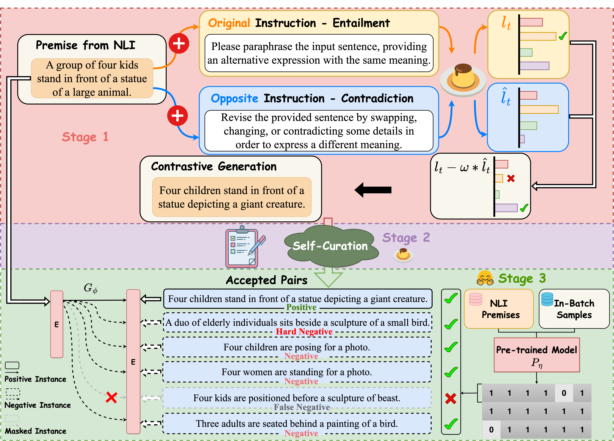
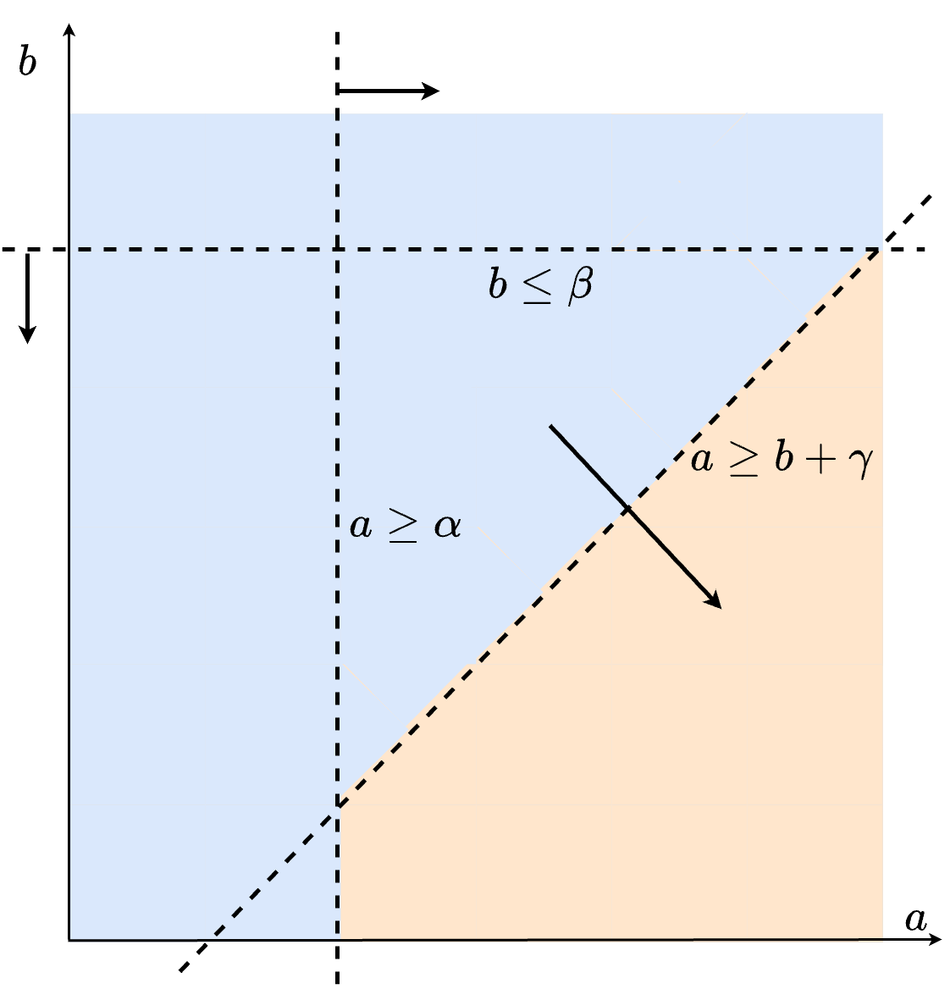

## MultiCSR: Multi-Level Contrastive Sentence Representation Learning

This repository contains the code for our paper [Large Language Models can Contrastively Refine their Generation for Better Sentence Representation Learning](https://arxiv.org/abs/2310.10962).

## Quick Links

  - [Overview](#overview)
  - [MultiCSR](#multicsr)
    - [Requirements](#requirements)
    - [Evaluation](#evaluation)
    - [Unlabeled Sentences](#unlabeled-sentences)
    - [Stage 1 - Sentence Generation and Scoring](#stage-1---sentence-generation-and-scoring)
    - [Stage 2 - Self-Curation](#stage-2---self-curation)
    - [Stage 3 - In-Batch Training](#stage-3---in-batch-training)
  - [Citation](#citation)


## Overview

We propose a multi-level contrastive sentence representation learning framework that decomposes the process of prompting LLMs to generate a corpus for training base sentence embedding models into three stages (i.e., sentence generation, sentence pair construction, in-batch training) and refines the generated content at these three distinct stages, ensuring only high-quality sentence pairs are utilized to train a base contrastive learning model, such as SimCSE. We firstly utilize the randomly sampled sentences from Wikipedia or premises from NLI (same as SimCSE) as the unlabeled sentences, then we will prompt LLMs to generate the corresponding `entailment` and `contradiction` hypotheses which will be used as the positive and hard negative samples of the given sentence. In stage 2, we will prompt LLMs to measure the similarity of each sentence pair, and perform self-curation which will filter out "low-quality" sentence pairs with a pre-defined strategy. During the in-batch training in stage 3, we utilize a pre-trained sentence embedding model to mask out false negatives which are semantically similar with the premise but are incorrectly utilized as negative samples.

<!--  -->


## MultiCSR

In this section, we describe how to prompt LLMs to generate entailment and contradiction hypotheses and perform self-curation, and how to train a base model such as SimCSE and reduce the impact of false negatives with a pre-trained model.

### Requirements
As prompting LLMs for generation and training a base model has different requirements, we suggest to install different dependencies for them.

First, when prompting LLMs for generation, try to make sure that `transformers` is updated and supports `AutoModel` and `AutoTokenizer`.

Second, we will try to maintain the same dependencies with the base model. In this repo, we implement our method over SimCSE. Following the instructions from [their official repo](https://github.com/princeton-nlp/SimCSE/tree/main), we suggest to install the correct `1.7.1` PyTorch version corresponding to your platforms/CUDA versions. And PyTorch version higher than `1.7.1` should also work. For example, if you use Linux and **CUDA11** ([how to check CUDA version](https://varhowto.com/check-cuda-version/)), install the corresponding PyTorch by the following command, 

```bash
pip install torch==1.7.1+cu110 -f https://download.pytorch.org/whl/torch_stable.html
```

You can also find other commands to install the specific versions of PyTorch in [this link](https://pytorch.org/get-started/previous-versions/).

If you instead use **CUDA** `<11` or **CPU**, install PyTorch by the following command,

```bash
pip install torch==1.7.1
```

Then run the following script to install the remaining dependencies,

```bash
pip install -r requirements.txt
```

### Evaluation
Following the officially released code of SimCSE, our evaluation code for sentence embeddings is also based on [SentEval](https://github.com/facebookresearch/SentEval). It evaluates sentence embeddings on semantic textual similarity (STS) tasks and downstream transfer tasks. For STS tasks, our evaluation takes the "all" setting, and report Spearman's correlation.

Before evaluation, please download the evaluation datasets by running
```bash
cd SentEval/data/downstream/
bash download_dataset.sh
```

### Unlabeled Sentences

To make a fair comparison, we use the same data resources from SimCSE, which are 1 million sentences from English Wikipedia, and NLI datasets (SNLI and MNLI). You can run `data/download_wiki.sh` and `data/download_nli.sh` to download the two datasets. It is also important to note that, for the NLI datasets, we will only use the premises and skip the human-annotated hypotheses.

### Stage 1 - Sentence Generation and Scoring

```python
python flan_generate_scoring.py
```
You can indicate the data resources with the `--source` argument. For the arguments `--part`, `--total_part`, `--start` and `--end`, we are utilizing them to control the range of sentences used for generation at a time. After running the script, you can get a csv file which includes `premise`, `entailment`, `contradiction`, `premise_entailment_similarity` and `premise_contradiction_similarity`. We will use the generated similarity scores to perform the self-curation.

### Stage 2 - Self-Curation
In this stage, we want to filter some low-quality sentence pairs using the similarity scores generated in stage 1, as shown in the following figure.

<!--  -->


You can get a light but high-quality corpus by running the following command:

```python
python flan_filter.py
```

You can also define your own filtering strategy by modifying the arguments `--positive_line`, `--negative_line` and `--similarity_gap`. In this case, please remember to modify the `--target` filename. An example command can be:

```python
python filter.py --positive_line 3 --negative_line 3 --similarity_gap 1 --target filter15_nli --score flan_nli
```

If you are using a pre-generated corpus, such as human-annotated NLI datasets (which are usually in high-quality) or datasets generated by other methods such as [SynCSE](https://huggingface.co/datasets/hkust-nlp/SynCSE-partial-NLI), please indicate the argument `--score` to 0 and the script will automatically perform scoring and further filter the poor sentence pairs. An example command can be:

```python
python filter.py --source nli --target filter15 --score 0 --filter_type 15 
```

### Stage 3 - In-Batch Training

**Training scripts**

We provide the training script and have set up some hyperparameters for training a base model SimCSE. We will also utilize a pre-trained sentence embedding model to reduce the impact of false negatives. In our experiments, we use the corresponding SimCSE versions ([BERT-base](https://huggingface.co/princeton-nlp/unsup-simcse-bert-base-uncased)/[RoBERTa-base](https://huggingface.co/princeton-nlp/unsup-simcse-roberta-base)). You can also automatically train and acquire these backbone models by yourselves. 

Although our script supports multi-gpus, in our experiments, we find that training with various gpus will influence the performance. We assume that this is due to the fact that contrastive sentence embedding methods like SimCSE are sensitive with the batch size and setting multi-gpus will reduce the batch size used in a single gpu.

We explain some important arguments in following:

* `-m`: model_name_or_path. The backbone models to start with, such as [BERT-base](https://huggingface.co/google-bert/bert-base-uncased) and [RoBERTa-base](https://huggingface.co/FacebookAI/roberta-base).
* `-d`: train_file. Training file path. We only support "csv" files because we hope each sentence will have its related entailment and contradiction.
* `-n`: pretrained_model_name_or_path. Pre-trained sentence embedding models, which will be used to provide the mask for filtering false negatives during the in-batch training. We highly suggest using the pre-trained checkpoints of SimCSE ([BERT-base](https://huggingface.co/princeton-nlp/unsup-simcse-bert-base-uncased)/[RoBERTa-base](https://huggingface.co/princeton-nlp/unsup-simcse-roberta-base)).
* `-p`: phi. A hyperparameter to control the threshold. We only utilize sentence pairs with their similarity scores lower than `phi` as the negative pairs.

For results in the paper, we use Nvidia V100-32G to prompt Flan-T5-XL and Nvidia V100-16G with CUDA 11 to train base SimCSE models. Using different types of devices or different versions of CUDA/other softwares may lead to slightly different performance.


An example command to run our scripts is:
```bash
bash run.sh -m bert-base-uncased -d nli -e 3 -b 128 -r 5e-5 -l 32 -y 42 -g 1 -t 25 -n princeton-nlp/unsup-simcse-bert-base-uncased -p 0.95
```

## Citation

If you find our code useful and use MultiCSR in your work, please cite our paper.

<!-- ```bibtex
@inproceedings{xxxxx,
   title={Large Language Models can Contrastively Refine their Generation for Better Sentence Representation Learning},
   author={Wang, Huiming and Li, Zhaodonghui and Cheng, Liying and Soh, De Wen Soh and Bing, Lidong},
   booktitle={North American Chapter of the Association for Computational Linguistics (NAACL)},
   year={2024}
}
``` -->
